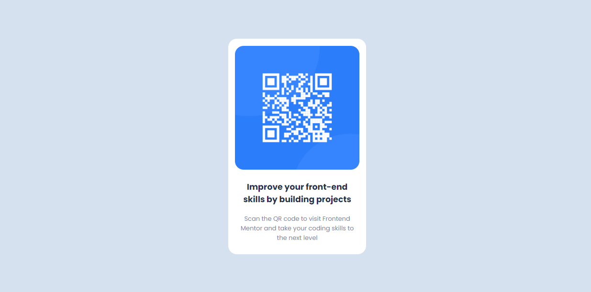

# Frontend Mentor - QR code component solution

This is a solution to the [QR code component challenge on Frontend Mentor](https://www.frontendmentor.io/challenges/qr-code-component-iux_sIO_H). Frontend Mentor challenges help you improve your coding skills by building realistic projects. 

## Table of contents

- [Overview](#overview)
  - [Screenshot](#screenshot)
  - [Links](#links)
- [My process](#my-process)
  - [Built with](#built-with)
  - [What I learned](#what-i-learned)
  - [Continued development](#continued-development)
- [Author](#author)
- [Acknowledgments](#acknowledgments)

## Overview

### Screenshot

### Links

- Solution URL: [GitHub](https://github.com/Eugene-ak/qr-code-component.git)
- Live Site URL: [Add live site URL here](https://your-live-site-url.com)

## My process

### Built with

- [Sass](https://sass-lang.com/) - For styling
- [Vitejs](https://vitejs.dev/guide/) - Framework
- [React](https://reactjs.org/) - JS library

### What I learned

This project introduced me to styling with `Sass`. I learnt how to integrate sass into react applications, write clean sass syntax and partition sass code into different files. I also learnt sass concepts such as nesting and declaring variables and mixins (css functions) which can be used to reduce redundancy.

### Continued development

Although I am conversant with the basics of sass, I will like to learn more about it as it makes css more lightweight. I will use it in my next projects in order to understand how it works and why I should prefer sass to other styling approaches.

## Author

- Website - [Eugene K. S. Amedior](https://portfolio-website-27ll.onrender.com/)
- Frontend Mentor - [@Eugene-ak](https://www.frontendmentor.io/profile/Eugene-ak)

## Acknowledgments

Many thanks goes to owner of the channel, Netninja on YouTube, which introduced the concept of sass with very clear understanding.
